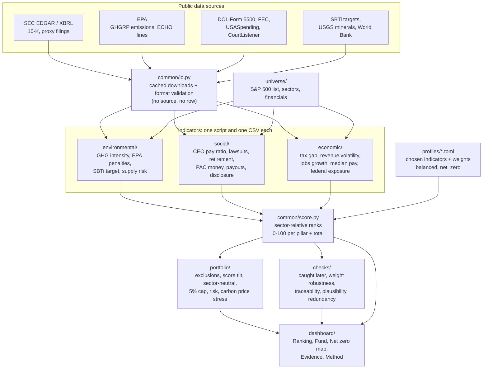

# S&P 500 Sustainability Scorer

**Built at EThack 2026 (Challenge #1).** It scores all 500 S&P 500 companies on sustainability
using only public records, builds a sustainability-tilted $1bn index fund from the scores,
answers the net-zero bonus question, and tests whether the score actually means something.

> **Our definition:** a sustainable company can keep running for decades without wearing down
> the planet, its people, or its own economic base.

```bash
git clone https://github.com/Arash-ethz-1/EThack.git
cd EThack
python run.py setup        # once: installs pandas, numpy, requests, ...
python run.py dashboard    # http://127.0.0.1:8500
```

---

## The challenge

> Build a data-driven framework to quantify and compare the sustainability of companies in the
> S&P 500. Define what sustainability means, identify and justify the indicators, source the
> data, and develop a methodology to score, rank or compare companies.
>
> **Bonus:** tomorrow the world commits to net zero as fast as possible. You manage a $1 billion
> fund. How do you allocate it, and why?

## Results at a glance

| | |
|---|---|
| **Indicators** | 15, all from public records (SEC, EPA, Department of Labor, FEC, SBTi, USGS), every value linked to its source document |
| **Fairness** | companies are ranked only against their own GICS sector: a bank is never compared with a steel maker |
| **Predictive check** | scores rebuilt with data up to 2021: the worst fifth in each sector was fined by the EPA in 2022-2025 **3.3x as often** as the best fifth (26% vs 8%) |
| **Robustness** | under 1,000 random weightings the ranking keeps a median rank correlation of **0.87** with ours |
| **Net-zero fund** | carbon intensity **79.6** vs 138.2 tCO2e/$M for the index, 60% of the money with a science-based target (index 45%), tracking error 1.9% |
| **Carbon price stress** | a $130/t carbon price takes 8.2% of pre-tax profit in the index, 8.0% after excluding oil & gas, **5.3%** in our net-zero fund |

The main finding for the bonus question: **excluding fossil fuels alone barely changes the fund's
carbon cost exposure. The tilt inside every sector does the work.** So the answer is: sell the fuel,
re-weight the rest, keep the market.

## How everything is connected



1. **Sources to indicators.** Each indicator has a script that downloads its public source once
   (cached, with the URL and time logged) and writes one CSV: `ticker, year, value, source, source_url, retrieved, note`.
   The writer refuses rows without a source. Missing data stays missing: nothing is estimated.
2. **Indicators to scores.** A profile picks indicators and weights. `common/score.py` ranks every
   company within its sector, averages per pillar and combines the three pillars into a 0-100 total.
   Deterministic code, no model calls.
3. **Scores to a fund.** Start from the S&P 500, exclude tobacco and oil & gas, tilt each weight
   by the score, keep every sector's size, cap each company at 5%.
4. **Checks.** The same scores are tested: would they have flagged future EPA fines? Do they survive
   different weights? Does every value trace back to a document?
5. **Dashboard.** You set the weights, press Compute, and the pipeline runs live. Every number links
   to the filing it came from, and the Method tab walks one company from raw value to dollars in the fund.

## Indicators

Three pillars, one plain question each.

| Pillar | Question | Indicators |
|---|---|---|
| **Environmental** | Is it damaging nature, and does it depend on resources that may run out? | GHG emissions per $M revenue (EPA GHGRP), EPA penalties per $bn revenue, science-based climate target (SBTi), critical material supply risk (USGS) |
| **Social** | Does it treat the people who work for it fairly and safely? | CEO-to-median-worker pay ratio, employment lawsuits per $bn revenue, employer retirement contribution, corporate PAC money per $M revenue, shareholder payout ratio, human capital disclosure |
| **Economic** | Can it sustain itself and the economy around it? | tax rate gap, revenue volatility, employment growth, median worker pay, federal contract concentration |

Every indicator is size-neutral (per revenue, per employee, a ratio or a score), covers at least
70% of the index, uses data from 2022 or newer and can be rebuilt with one command.
Details: [`docs/DATA_FORMAT.md`](docs/DATA_FORMAT.md), [`docs/SCORING.md`](docs/SCORING.md).

## Dashboard

| Tab | What it shows |
|---|---|
| **Ranking** | all companies, total and pillar scores, filter by sector |
| **Fund** | the $1bn allocation vs the index: score, carbon intensity, SBTi share, tracking error |
| **Net zero** | three funds side by side, carbon price stress test, and a US map of 2,167 large plants owned by S&P 500 companies coloured by what the fund does with the owner |
| **Evidence** | the predictive test, the weight test, and an audit of any company from its own 10-K sentences and EPA record |
| **Method** | one company, every step, with real numbers and source links |

## Commands

```bash
python run.py build environmental      # rebuild indicators from public sources
python run.py score net_zero           # scores/net_zero/scores.csv
python run.py portfolio net_zero       # scores/net_zero/portfolio.csv
python run.py verify                   # data-trust checks -> checks/results/
python run.py check                    # format validation + tests
python run.py dashboard                # open the dashboard
```

## Repository layout

| Folder | Contents |
|---|---|
| `universe/` | S&P 500 constituents, sectors, SEC financials |
| `environmental/`, `social/`, `economic/` | `catalog.csv`, one script per indicator, output CSVs, cached raw downloads |
| `common/` | shared I/O, validation and the scoring engine |
| `profiles/` | weighting profiles (`balanced`, `net_zero`) |
| `portfolio/` | allocation, market data, risk, net-zero transition analysis |
| `checks/` | evidence and data-quality checks |
| `dashboard/` | local web app (Python server + plain JS, d3-geo map) |
| `tests/` | pytest suite |
| `docs/` | [product summary](docs/PRODUCT.md), [pitch](docs/PITCH.md), [plan](docs/PLAN.md) |

## Limits we state openly

- US sources only (SEC, EPA, DOL): foreign plants and practices are mostly invisible.
- Emissions are Scope 1 from large US facilities; no Scope 2 or 3.
- SBTi targets are commitments, not emissions, which is why both are used.
- The carbon price test is a first-order exposure, not a forecast (no cost pass-through).
- Returns shown in the dashboard apply today's weights to the past 36 months: an illustration, not a backtest.

## Team

Built in one hackathon by **Arash** (scoring pipeline, portfolio, dashboard, checks),
**Jean** (environmental), **Florian** (social) and **Lauren** (economic, social).

The team worked on one `main` branch with AI coding agents; the rules they followed are in
[`AGENTS.md`](AGENTS.md).
